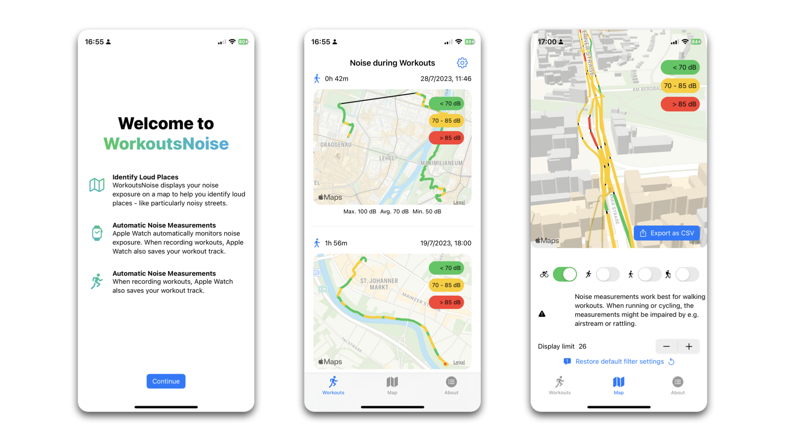

#  WorkoutsNoise

Apple Watch automatically monitors your noise exposure and notifies you when your environment noise reaches dangerous levels.

I was constantly getting Noise Notifications on my bike commute - so my idea was to use these measurements to find a **quieter** route to work. So I made this little app that **combines workout paths with noise measurements.** If you're using Apple Watch to record walking or cycling workouts, it should work for you.

Note: I made this app to explore the data & learn Swift. After doing some experiments, I'd say that the Watch mostly measures wind noise when cycling.

.

## Data Quality

There's a great paper on the accuracy of noise readings for Apple Watch:

> Are Smartwatches a Suitable Tool to Monitor Noise Exposure for Public Health Awareness and Otoprotection?
https://www.frontiersin.org/articles/10.3389/fneur.2022.856219/full

In various settings, the authors compare Apple Watch with a professional Sound Pressure Meter and conclude that the Apple Watch is reasonably accurate. *However, the study did not include workouts.*

Workouts are different from the scenarios of the study:

- the Watch is exposed to wind and airstream
- your wrist is extremely close to e.g. the bicycle bell
- your clothes might rub against the Watch's microphones

In my experience so far, **airstream significantly influences the Apple Watch noise readings.** That is, during a cycling workout, you're not actually measuring the environment noise, but the noise caused by wind passing the Watch microphones.

# Installation from Source

- Download and open this repository in Xcode.
- Set your iPhone to Developer Mode.
- Sign the project with your Apple ID.

### Privacy

The app reads Health data and plots it on a map. Your data is not leave your devie. If you uninstall or quit the app, all temporary data is gone. The app is using the iOS ecosystem, Apple Health and Apple Maps SDK.

### Disclaimer

To the best of my knowledge, it should not cause any loss of data. However, I made this app to learn Swift - so I can't guarantee for anything :) 

Apple Watch, Apple Heath, iOS etc. are trademarks of Apple Inc. This repository is not affiliated with Apple.
